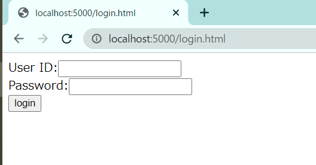
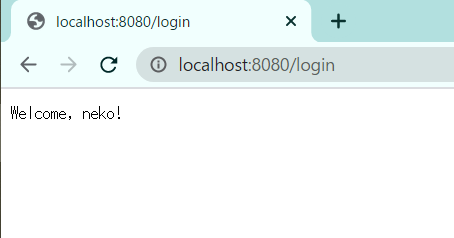
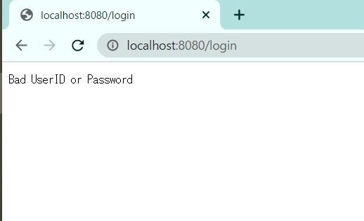

# ログインするだけのwebページ

ログインするだけ。

# 動作方法

WSLでのデータベースの使い方：https://docs.microsoft.com/ja-jp/windows/wsl/tutorials/wsl-database

事前にmySQLにてデータベースとテーブルを作成し、nameとdigestのペアを挿入しておく。digestはnameに対応するpasswordを一方向性ハッシュ関数MD5を用いて変換したものとする。

```bash
python3 -m http.server 5000
```

と

```bash
source .env
cargo run
```

をして、ブラウザから http://localhost:5000/login.html にアクセスする。



UserIDとPasswordを入れるとログインの成否によって異なるレスポンスが返ってくる。





# 改善点

* 構成図を書く
* ログインに成功したら5000にリダイレクトする方がよい（？）
* DBにユーザを追加する機能の実装。
* DBからユーザを削除する機能の実装。
* ログインに失敗したページにログインページへのリンクを貼る。
* pythonで呼ぶのではなくhttpサーバも書く？